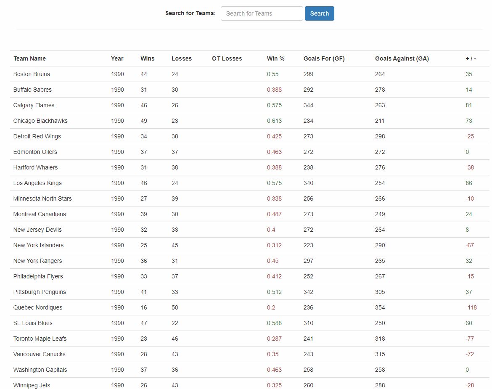
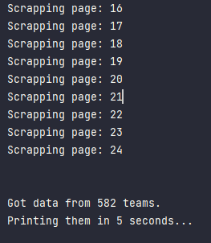
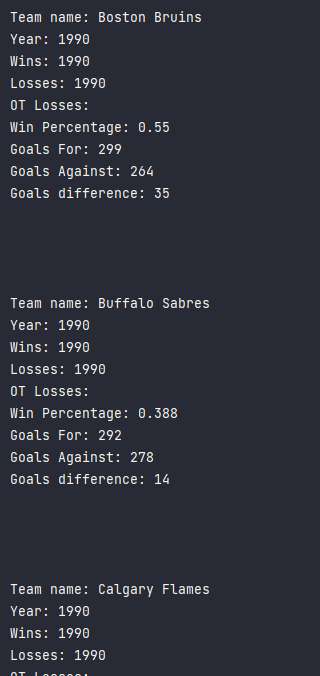

# "Webscraping"
Webscraping sample made to learn BeautifulSoup basics and the use of session from requests lib to make the get requests runs faster.

## Tecnologies

- Python
- BeautifulSoup
- Requests

## Data to be scrapped

# Scrapper working images:

